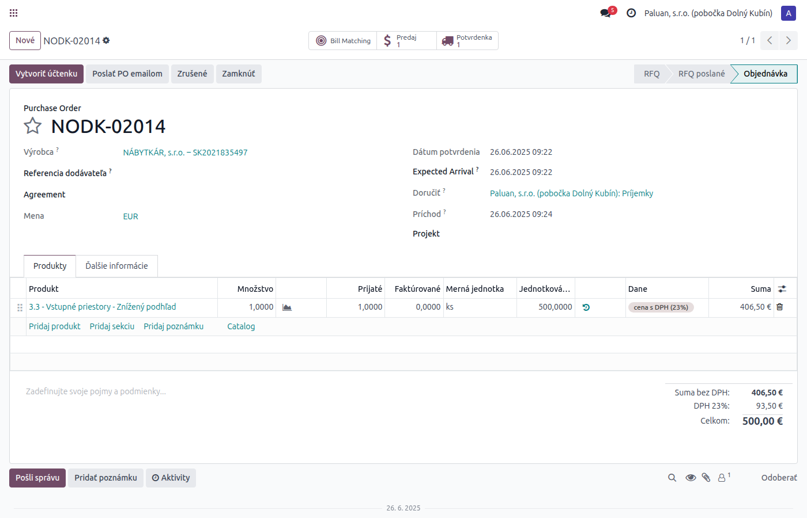
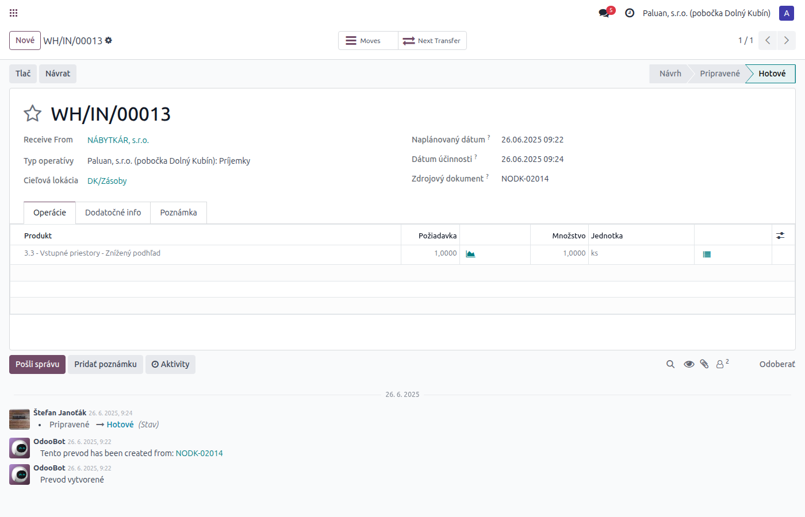
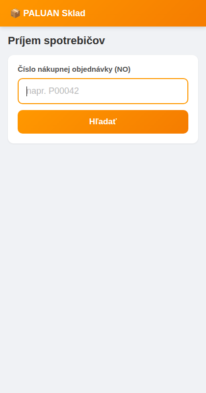
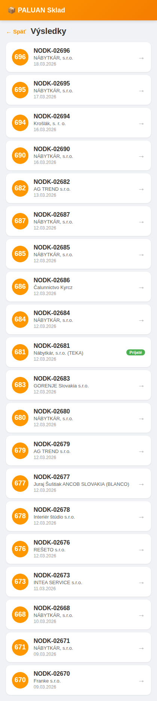
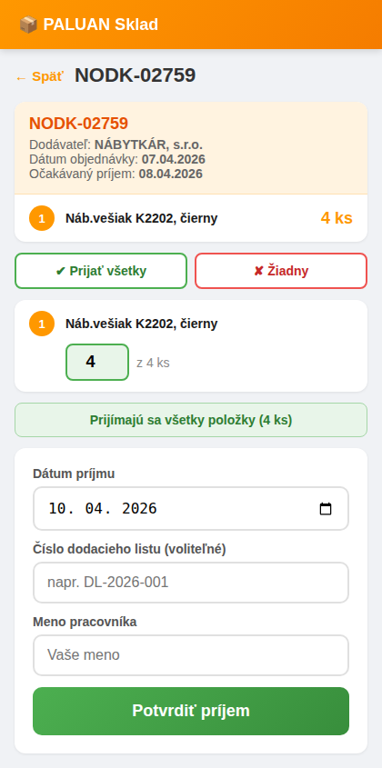
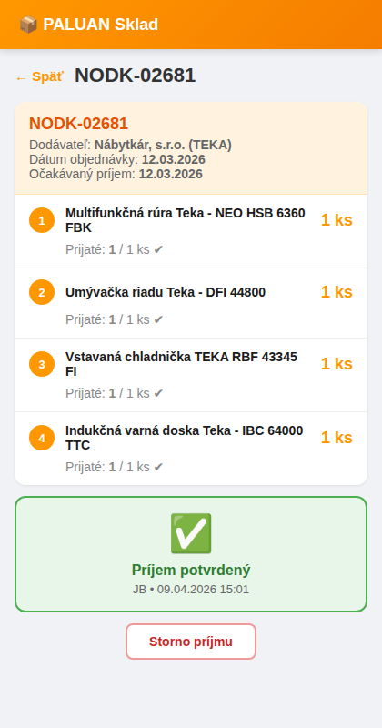

# Príjem tovaru — celý obeh

## 1. Zákaznícka objednávka (SO)

Na SO vidíte pole **"NO"** s číslom nákupnej objednávky a tlačidlo **"Nákup"** pre priamy prístup.

---

## 2. Nákupná objednávka (NO)

Detail NO s riadkami a tlačidlom **"Príjemky"** na sledovanie príjmu.

---

## 3. Príjem v Odoo (stock picking)

Príjemka s prijatým množstvom a stavom **Hotovo**.

---

## 4. Mobilná aplikácia — Príjem spotrebičov

### Úvodná obrazovka
Zadáte číslo NO a hľadáte.

### Výsledky hľadania
Zoznam nájdených NO. Zelený badge = už prijaté.

### Formulár príjmu
Zadáte množstvo pre každú položku, dátum, číslo dodacieho listu a meno pracovníka.

### Potvrdený príjem
Po potvrdení vidíte kto a kedy prijal. Možnosť storna.

