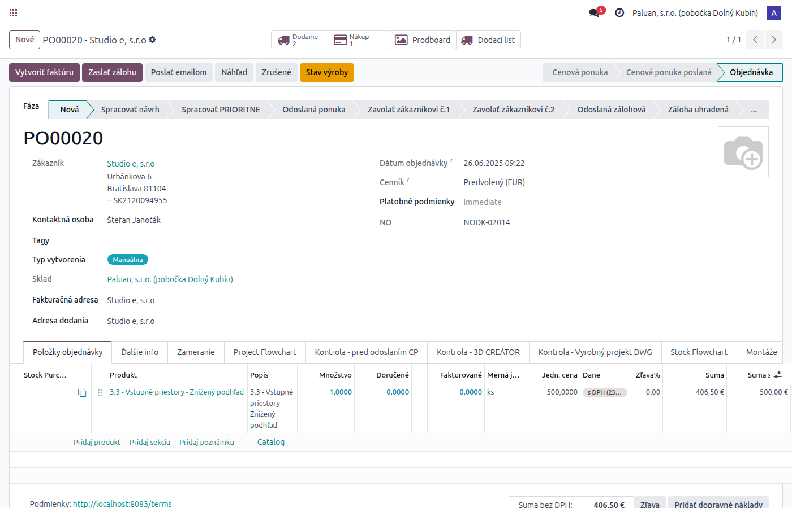

# Príjem tovaru — celý obeh

## Odoo backend

### 1. Zákaznícka objednávka (SO) — prepojenie na NO
Pole **"NO"** zobrazuje číslo nákupnej objednávky. Tlačidlo **"Nákup"** otvorí priamo NO.

---

### 2. Nákupná objednávka (NO) — detail
Riadky objednávky, dodávateľ, stav. Tlačidlo **"Príjemky"** na sledovanie príjmu.

---

### 3. Príjemka — potvrdenie príjmu
Príjemka WH/IN so stavom **Hotovo** = tovar bol fyzicky prijatý na sklad.

---

### 4. SO — overenie stavu príjmu
Späť na SO vidíte stav dodávky a že NO bola spracovaná.

---

## Mobilná aplikácia — Príjem spotrebičov

### 5. Úvodná obrazovka
Zadajte číslo NO a kliknite Hľadať.

### 6. Výsledky hľadania
Zoznam nájdených NO. Zelený badge **"Prijaté"** = už potvrdené.

### 7. Formulár príjmu
Zadajte množstvo pre každú položku, dátum, dodací list a meno pracovníka.

### 8. Potvrdený príjem
Kto a kedy potvrdil príjem. Možnosť storna.

